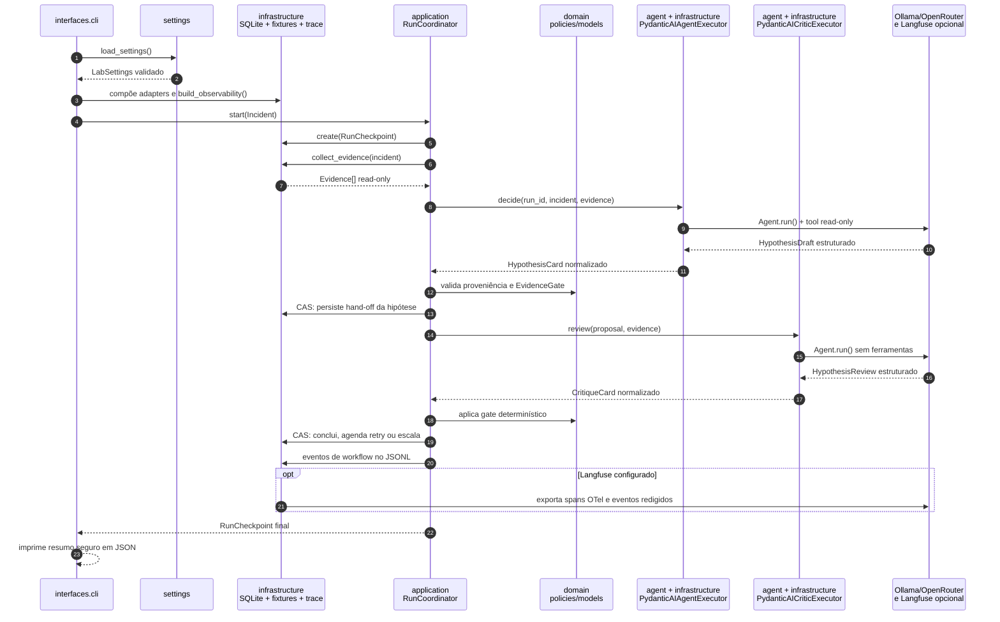

# Arquitetura do repositório: Clean Architecture e Hexagonal

O laboratório usa uma variação pragmática de Clean Architecture/Ports and Adapters. A regra central é simples: as regras de negócio e a orquestração não conhecem SQLite, PydanticAI, Ollama, OpenRouter, Langfuse, arquivos de fixture nem argparse.

```text
                         interfaces
                    CLI e inspeção local
                              │
                              ▼
                        application
          coordenação, conversão e portas (Protocols)
                    ▲                         │
                    │                         ▼
                 domain                 infrastructure
          modelos e políticas       SQLite, PydanticAI, trace,
                                    providers e fixtures
```

As setas representam dependências de código. `infrastructure` implementa contratos definidos em `application`; ela não dita suas regras. O `domain` fica no centro e não importa qualquer detalhe técnico.

## Estrutura de diretórios

```text
src/aula12_agents/
├── domain/                 # linguagem e invariantes do problema
├── application/            # casos de uso e portas
├── agent/                  # contratos e construção dos agentes PydanticAI
├── infrastructure/         # adapters concretos
│   ├── fixtures/           # corpus sintético e gateway read-only
│   ├── persistence/        # SQLite e CAS
│   ├── providers/          # mock, Ollama e OpenRouter
│   └── trace/              # JSONL, Langfuse e OpenTelemetry
├── interfaces/             # CLI e leitura segura de artefatos locais
└── settings.py             # configuração validada nas bordas
```

Os testes seguem a mesma ideia: `unit/` testa regras locais; `contract/` verifica que adapters respeitam as portas; `integration/` cobre integrações como SQLite e Langfuse; `e2e/` exercita o workflow inteiro.

## Domain: regras que sobrevivem à troca de tecnologia

`domain/models.py` contém modelos Pydantic imutáveis, estritos e serializáveis, como `Incident`, `Evidence`, `HypothesisCard`, `CritiqueCard` e `RunCheckpoint`. Eles impõem invariantes importantes:

- uma conclusão precisa referenciar evidências;
- um checkpoint concluído precisa conter a decisão `conclude`;
- uma execução em retry precisa ter `retry_at`;
- a etapa `review_hypothesis` exige uma hipótese persistida;
- chaves de idempotência de efeitos não podem se repetir.

`domain/policies.py` reúne regras que não pertencem ao LLM: transições válidas de checkpoint, gate de evidências, e merge de referências. Essas regras recebem dados e devolvem sucesso ou uma violação; não realizam I/O.

## Application: orquestração sem dependência de framework

`application/ports.py` define as portas como `Protocol`:

| Porta | O que a aplicação pede |
| --- | --- |
| `CheckpointStore` | Criar, carregar e avançar checkpoints por CAS. |
| `ReadOnlyToolGateway` | Coletar evidências. |
| `AgentExecutor` | Produzir uma `HypothesisCard`. |
| `CriticExecutor` | Revisar uma proposta tipada. |
| `RunEventSink` / `WorkflowEventObserver` | Registrar eventos e telemetria sem acoplar o fluxo a um backend. |
| `RetryScheduler` | Tornar um retry visível/agendável. |

`RunCoordinator` é o caso de uso principal. Ele recebe somente essas portas no construtor, o que permite trocar um provider, uma base de dados ou um test double sem reescrever a lógica de transição.

`application/conversion.py` separa "o LLM devolveu um objeto" de "o domínio aceita esse objeto". A conversão é o ponto onde contratos de adapter passam a ser artefatos de negócio, antes do gate de proveniência e da persistência.

## Agent: borda especializada de PydanticAI

`agent/` não é o domínio. É a camada que declara como os especialistas conversam com PydanticAI:

- `contracts.py`: schemas de entrada/saída do modelo e do hand-off;
- `deps.py`: dependências tipadas injetadas em runtime;
- `toolsets.py`: toolset limitado a leitura;
- `prompts.py`: instruções versionadas;
- `validators.py`: validação e `ModelRetry` para corrigir formato/consistência de saída;
- `factory.py`: construção dos agentes e seus `UsageLimits`;
- `history.py`: serialização/redaction de histórico, que não é fonte de verdade do workflow.

PydanticAI depende desses contratos, mas `domain/` e `application/` não importam o framework. Assim, se a aula quiser comparar outro SDK no futuro, a mudança se concentra em adapters e nessa borda.

## Infrastructure: implementações substituíveis

| Adapter | Porta que atende | Detalhe técnico isolado |
| --- | --- | --- |
| `persistence/sqlite.py` | `CheckpointStore`, `RunEventSink` | SQLite, serialização JSON e controle otimista de concorrência. |
| `fixtures/gateway.py` | `ReadOnlyToolGateway` | Fixtures locais, limites e sanitização. |
| `agent_executor.py` | `AgentExecutor`, `CriticExecutor` | `Agent.run(...)`, dependências e conversão de contratos PydanticAI. |
| `providers/factory.py` | modelo usado pelo adapter de agente | mock, Ollama e OpenRouter; fallback 402 controlado. |
| `trace/` | `WorkflowEventObserver` e observações auxiliares | JSONL local, Langfuse e OpenTelemetry. |

Um adapter pode falhar, mas não deve alterar a semântica do domínio. Por exemplo, ausência de credenciais Langfuse muda apenas o destino remoto da telemetria: o JSONL local continua sendo gravado.

## Interfaces: bordas de entrada e leitura

`interfaces/cli.py` compõe a aplicação: carrega configurações, escolhe os adapters, constrói o coordenador e executa `run` ou `resume`. É a única camada que sabe simultaneamente quais implementações concretas serão usadas.

`interfaces/inspection.py` trata os artefatos locais como uma interface de leitura. Os comandos `list-runs`, `show-run`, `show-events` e `show-trace` exibem projeções redigidas; eles não precisam instanciar um provider nem chamar Langfuse.

## Fluxo de dependências em um comando CLI

```text
aula12-agents run
  │
  ├─ interfaces.cli: carrega LabSettings e compõe adapters
  ├─ infrastructure: SQLite + fixtures + provider + trace
  └─ application.RunCoordinator
       ├─ domain: valida modelos, políticas e transições
       └─ ports: chama adapters sem conhecer suas classes concretas
```

A composição nas bordas é o que evita um "container de DI" complexo para este laboratório: a injeção é explícita no construtor de `RunCoordinator` e nas dependências de PydanticAI.

## Sequência simplificada de `aula12-agents run`

O diagrama abaixo mostra uma execução completa com provider real. Ele agrupa detalhes internos — validações Pydantic, eventos individuais e serialização — para evidenciar as fronteiras entre pacotes. No modo `mock`, os dois adapters PydanticAI são substituídos pelos executores determinísticos da CLI; o coordenador e a persistência continuam iguais.



Repare que chamadas ao modelo ocorrem somente nos adapters de agente. A decisão de concluir, repetir ou escalar volta para `RunCoordinator`, que a aplica com políticas de domínio e compare-and-swap no checkpoint.

O mesmo fluxo está disponível para edição em [Excalidraw](diagramas/dispatch-sequencia.excalidraw).

## Configuração e segurança nas bordas

`settings.py` lê ambiente e `.env` por meio de modelos Pydantic. Os segredos ficam em `SecretStr` e não atravessam domain/application. `.env` e artefatos de execução são ignorados pelo Git; `.env.example` é a documentação segura do contrato de configuração.

O script `scripts/check_secrets.py` verifica apenas arquivos rastreados pelo Git e falha sem imprimir valores encontrados. O CI executa esse check antes de format, lint, tipo e testes.

## Como adicionar uma nova capacidade

Ao incluir, por exemplo, uma fonte real de evidência:

1. Defina ou reutilize uma porta em `application/ports.py`.
2. Modele os dados e invariantes em `domain/` se eles forem parte do negócio.
3. Implemente o adapter em `infrastructure/`.
4. Faça a composição em `interfaces/cli.py`.
5. Adicione teste de contrato para o adapter e E2E para a mudança de comportamento.

Evite importar uma classe de infraestrutura em `domain/` ou fazer o agente gravar diretamente no SQLite. Esses atalhos tornam o exemplo menos testável e escondem justamente as fronteiras que a aula quer ensinar.
